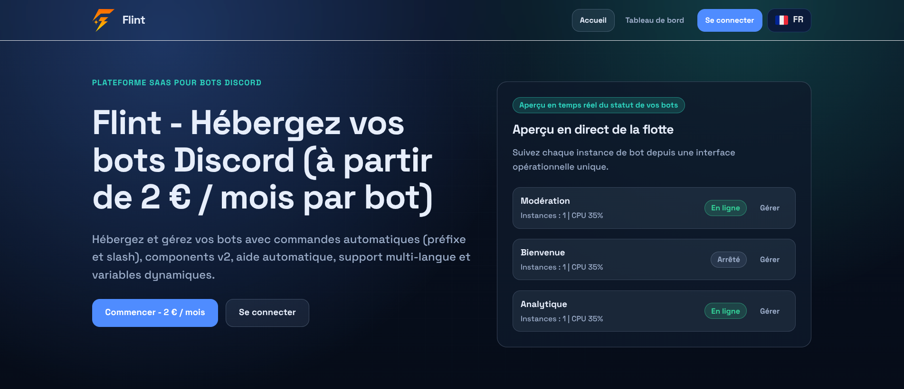
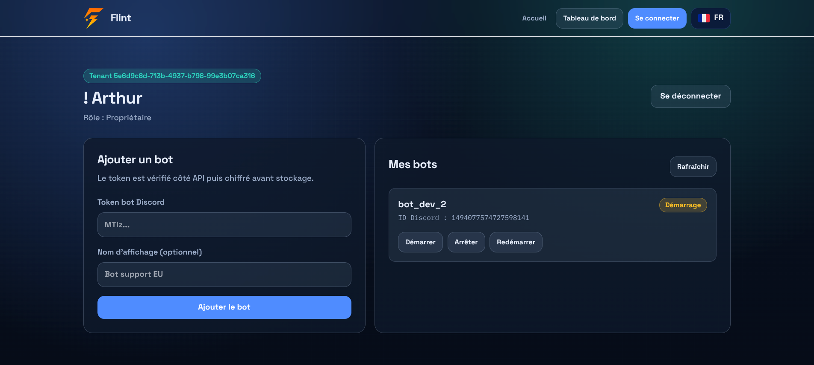
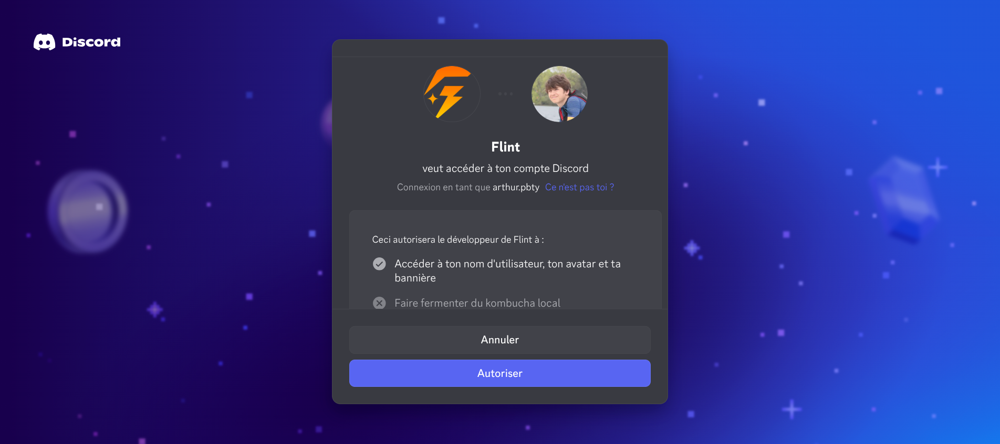

# 🚀 Flint — Discord Bot SaaS Platform (Multi-Tenant)

# [https://flint.arthurp.fr](https://flint.arthurp.fr/)

Flint est une plateforme SaaS permettant de gérer et orchestrer plusieurs bots Discord depuis une seule infrastructure scalable.

Elle repose sur une architecture **multi-tenant**, sécurisée et conçue pour supporter une montée en charge horizontale.

---

## 🧠 Concept

Au lieu de :

> ❌ 1 bot = 1 container

Flint utilise :

> ✅ 1 bot manager = N bots dynamiques

---

## 🏗️ Architecture globale

```txt
/apps
  web        → Dashboard Next.js (UI SaaS)
  api        → Backend (OAuth2 Discord + JWT + API multi-tenant)
  bot        → Bot manager (runtime multi-bots Discord)
/packages
  shared     → Types, crypto, Redis helpers
/database
  migrations → Schéma PostgreSQL versionné
```

---

## ⚙️ Stack technique

* **Frontend** : Next.js (App Router) + TailwindCSS
* **Backend** : Node.js + Express
* **Bot runtime** : Discord.js multi-instances
* **DB** : PostgreSQL 16
* **Queue** : Redis + BullMQ
* **Infra** : Docker Compose

---

## 🤖 Architecture runtime

### API (`apps/api`)

* OAuth2 Discord login
* JWT httpOnly session
* API multi-tenant complète
* Gestion des bots :

  * create / start / stop / restart
* Chiffrement AES-256-GCM des tokens Discord
* Rate limiting par tenant
* Queue de contrôle via BullMQ

---

### Bot Manager (`apps/bot`)

* Un seul service pour tous les bots
* Gestion dynamique :

```ts
Map<botId, DiscordClient>
```

* Worker Redis (BullMQ) :

  * start bot
  * stop bot
  * restart bot
* Reconnexion automatique
* Logs runtime en base

---

### Web App (`apps/web`)

Dashboard SaaS :

* Login Discord OAuth
* Liste des bots du tenant
* Création de bot via token
* Contrôle runtime (start / stop / restart)
* Interface multi-langue (i18n)

---

## 🗄️ Base de données

### Multi-tenant strict

Tables principales :

* `tenants`
* `users`
* `bots`
* `bot_runtime_events`

### Sécurité

* Isolation totale via `tenant_id`
* Tokens Discord chiffrés (AES-256-GCM)
* Logs séparés par tenant

---

## 🔐 Sécurité

* 🔒 Tokens bot jamais stockés en clair
* 🍪 JWT en cookie httpOnly
* 🧱 Isolation complète multi-tenant
* ⚡ Rate limiting par tenant
* 🧩 Redis namespaced
* 🚫 Aucun bot exposé individuellement

---

## 🐳 Docker architecture

Services :

* `web`
* `api`
* `bot`
* `postgres`
* `redis`

👉 Important :
Aucun container par bot → tout est centralisé

---

## 🚀 Installation

### 1. Cloner le projet

```bash
git clone https://github.com/ArthurP-fr/Flint.git
cd Flint
```

---

### 2. Configurer l’environnement

```bash
cp .env.example .env
```

---

### 3. Générer clé de chiffrement

```bash
openssl rand -base64 32
```

---

### 4. Installer les dépendances

```bash
npm install
```

---

### 5. Lancer la stack

```bash
docker compose up -d --build
```

---

## 🌍 Accès

* 🌐 Web : [http://localhost:3000](http://localhost:3000)
* ⚙️ API : [http://localhost:4000/health](http://localhost:4000/health)

---

## 📡 API

### Auth

* `GET /auth/discord/login`
* `GET /auth/discord/callback`
* `POST /auth/logout`
* `GET /api/me`

### Bots

* `GET /api/bots`
* `POST /api/bots`
* `POST /api/bots/:botId/start`
* `POST /api/bots/:botId/stop`
* `POST /api/bots/:botId/restart`

---

## 📈 Scalabilité

Flint est conçu pour être scalable horizontalement :

* API → scalable horizontal
* Bot manager → scalable avec Redis coordination
* PostgreSQL → recommandé managé
* Redis → central queue system

👉 Un seul bot service peut gérer **des centaines de bots Discord**

---

# 🖼️ Screenshots

### Home


### Bots


### Login


---

## 🎯 Objectif du projet

Flint vise à devenir une plateforme type :

> “Discord Bot as a Service”

avec une architecture proche d’un SaaS moderne (Vercel / Stripe style backend design).

---

## ⭐ Points forts

* Multi-tenant natif
* Runtime dynamique de bots
* Sécurité forte (chiffrement + isolation)
* Queue distribuée (BullMQ + Redis)
* Architecture scalable dès le départ
